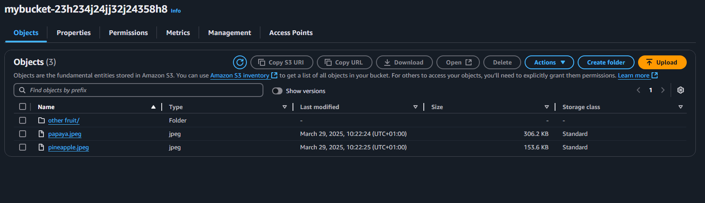
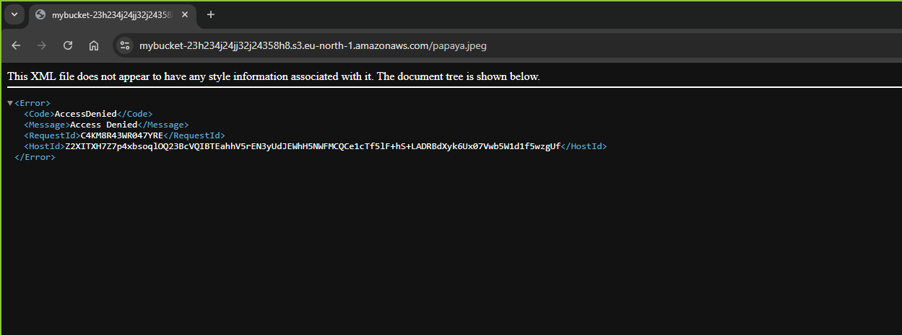
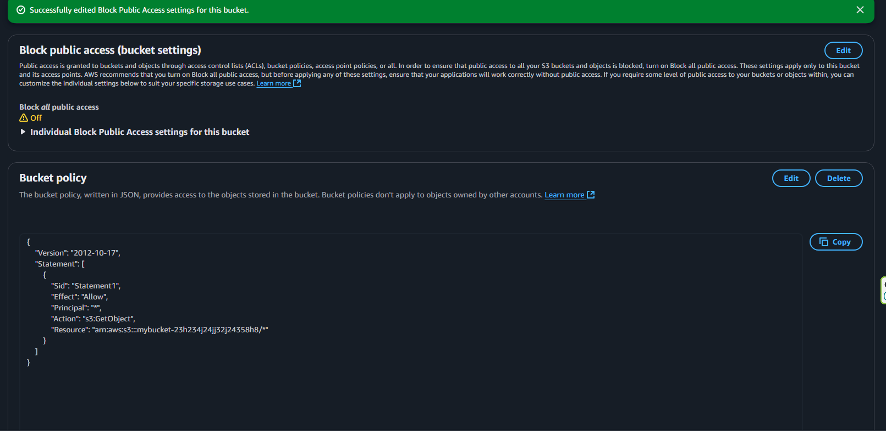

# 🌐 Hands-On AWS Project – Public Access to S3 Bucket via Bucket Policy

As part of my AWS Solutions Architect Associate hands-on labs (April 2025), I explored how to configure **public access to an S3 bucket** by applying a **custom bucket policy** and editing the public access settings.

This project contrasts **default access-denied behavior** with **explicit access control via IAM policies**.

---

## ✅ What Was Done

### 1. Create a Private S3 Bucket
- Bucket name: `mybucket-23h234j24jj32j24358h8`
- Default setting: **Block all public access** ON
- Uploaded:
  - `papaya.jpeg`
  - `pineapple.jpeg`
  - Folder: `other fruit/`

📸 _Screenshot:_  


---

### 2. Attempt to Access File via URL
- Accessing `https://mybucket-23h234j24jj32j24358h8.s3.eu-north-1.amazonaws.com/papaya.jpeg`
- Result: ❌ **Access Denied** (as expected, because bucket is private)

📸 _Screenshot:_  


---

### 3. Add Public Read Bucket Policy
```json
{
  "Version": "2012-10-17",
  "Statement": [
    {
      "Sid": "Statement1",
      "Effect": "Allow",
      "Principal": "*",
      "Action": "s3:GetObject",
      "Resource": "arn:aws:s3:::mybucket-23h234j24jj32j24358h8/*"
    }
  ]
}
```

- This allows anyone to GetObject (download) any file in the bucket.
- Note: Principal: "*" means access is open to everyone.
- Resource includes /* meaning “all objects inside the bucket”.

📸 Screenshot:


### 4. Result – Public Access Now Works
- After editing the bucket policy and disabling block public access settings, the object becomes publicly accessible.
- ✅ Success: Image papaya.jpeg now renders in browser via public URL.

📸 Screenshot:


🧠 Key Learnings
- S3 buckets are private by default, even if you upload objects.
- You must explicitly allow public access through:
    - Disabling “Block all public access”
    - Writing a proper bucket policy
- Useful for hosting static websites, image hosting, or public data sharing.


#AWS #S3 #BucketPolicy #IAM #GetObject #AWSHandsOn #CloudProjects #Serverless #SolutionArchitect #AWSSecurity #StaticWebsiteHosting