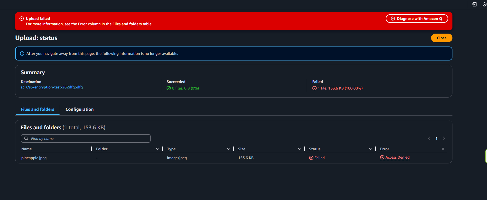
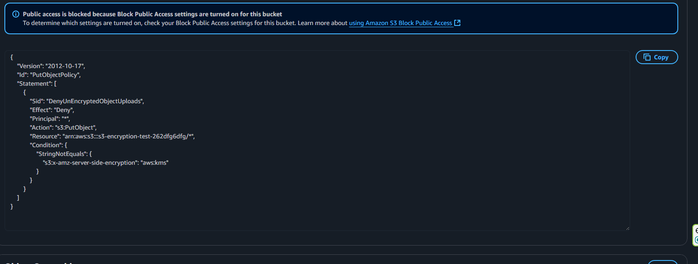
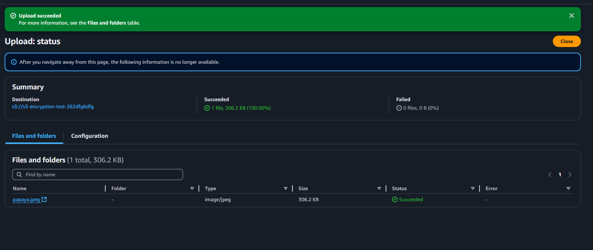

# 🔐 S3 Bucket Policy – Enforce KMS Encryption on Object Upload

## 📝 Overview
This hands-on demonstrates how to enforce **S3 server-side encryption with AWS KMS keys** by using a bucket policy that denies uploads without the required encryption setting.

The policy ensures that only objects encrypted with the specified KMS method can be uploaded to the bucket.

---

## 🔹 Steps Performed

### 1. **Create S3 Bucket**
- Created bucket: `s3-encryption-test-262dfg6dfg`
- Enabled **Block Public Access** for security.

### 2. **Apply Bucket Policy**
- Added a policy that **denies `s3:PutObject`** if the request does not include:
  ```json
  "Condition": {
      "StringNotEquals": {
          "s3:x-amz-server-side-encryption": "aws:kms"
      }
  }
    ```
- This enforces uploads to use **KMS encryption** only.

---

## 🔹 How to Apply Encryption Manually During Upload
When uploading an object to S3 using the AWS CLI, you can explicitly specify that it should be encrypted with AWS KMS by adding the `--server-side-encryption` parameter.

Example using AWS-managed KMS keys:
```bash
aws s3 cp papaya.jpeg s3://my-bucket-name/ \
  --server-side-encryption aws:kms
```

### 3. Test Upload Without KMS Encryption
```bash
aws s3 cp pineapple.jpeg s3://my-bucket-name/
```
- Attempted to upload `pineapple.jpeg` without specifying encryption.  
- **Result:** Upload failed with **Access Denied**.

### 4. Test Upload With KMS Encryption
- Uploaded `papaya.jpeg` with `--server-side-encryption aws:kms`.  
```bash
aws s3 cp papaya.jpeg s3://my-bucket-name/ \
  --server-side-encryption aws:kms
```
- **Result:** Upload succeeded.

---

## 🧠 Key Learnings
- Bucket policies can enforce encryption requirements, adding an extra layer of data security.
- Denying uploads without encryption ensures all data at rest complies with security standards.
- The `s3:x-amz-server-side-encryption` condition key is used to enforce a specific encryption type.
- This method works alongside AWS KMS to centrally manage encryption keys.

---

## 📷 Screenshots
- **Upload without encryption – Failed**  
 
- **Bucket policy enforcing KMS encryption**  

- **Upload with KMS encryption – Succeeded**


---

## 📦 Skills Demonstrated
- S3 bucket policy creation and management.
- Enforcing server-side encryption with AWS KMS.
- Testing and troubleshooting S3 upload permissions.
- Understanding encryption enforcement in AWS.

#AWS #S3 #BucketPolicy #KMS #ServerSideEncryption #CloudSecurity #AWSSolutionsArchitect #AWSHandsOn #AWSSAA #Encryption #DataProtection #CloudComputing #DevOps #CloudEngineer

