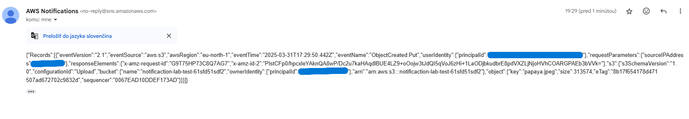

Overview
--------

Upload a file to an Amazon S3 bucket → S3 emits an **ObjectCreated** event → **SNS** topic → an email is delivered to a subscriber. Verify by uploading a test file (e.g., papaya.jpeg) and receiving an email from **AWS Notifications** that contains the S3 event details.

**Services:** Amazon S3 (Event Notifications) and Amazon SNS (Topic with Email subscription)

Architecture
------------

S3 bucket → (ObjectCreated events) → SNS Topic → Email Subscriber

Screenshots
-----------

    

Step-by-Step
------------

### 1) Create the SNS topic and email subscription

1.  Amazon SNS → Topics → Create topic → Standard. Name it **MyEmail**
    
2.  On the topic page, **Create subscription** → Protocol **Email** → enter your address
    

### 2) Allow S3 to publish to the SNS topic

Ensure the topic access policy allows the **S3** service principal to call SNS:Publish.Restrict it with **least privilege** using aws:SourceAccount (your account) and aws:SourceArn (your bucket ARN).

### 3) Create the S3 bucket and event notification

1.  Amazon S3 → Create bucket (e.g., notification-lab-test-)
    
2.  Properties → **Event notifications** → **Create event notification**
    
    *   Name: **ObjectCreatedToSNSTopic**
        
    *   Event types: **All object create events**
        
    *   Destination: **SNS topic** → select **MyEmail**
        
    *   Save
        

### 4) Test the flow

Upload any object to the bucket (e.g., papaya.jpeg). You should receive an **AWS Notifications** email with JSON showing bucket name, object key, size, request IDs, and more.
    
    
Key Learnings
-------------

*   S3 → SNS requires an SNS **topic access policy** that explicitly allows s3.amazonaws.com