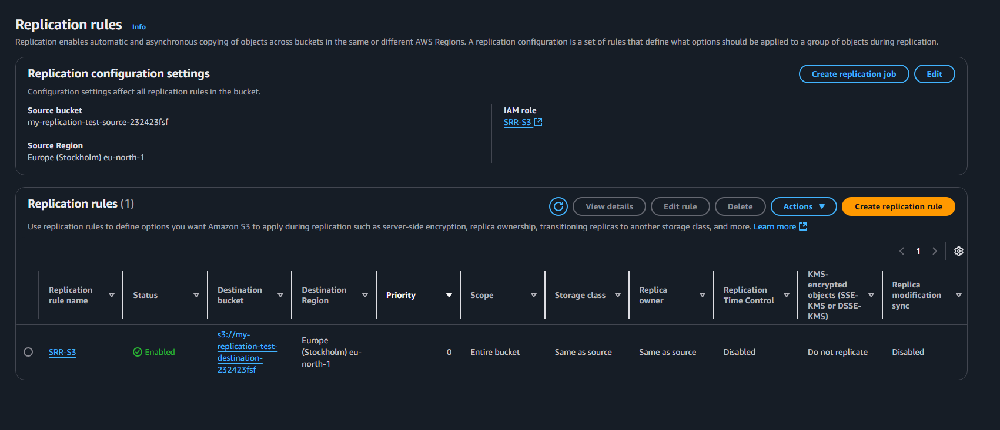
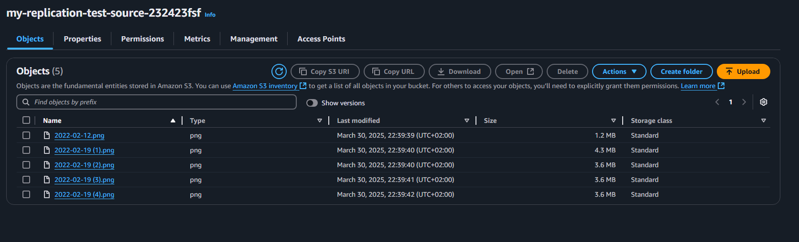
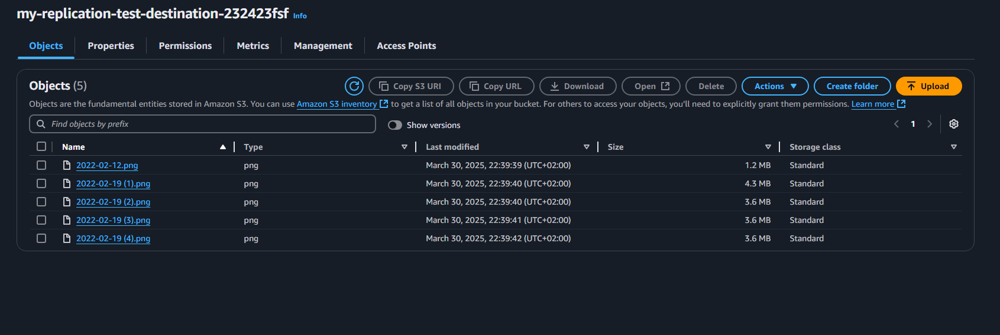
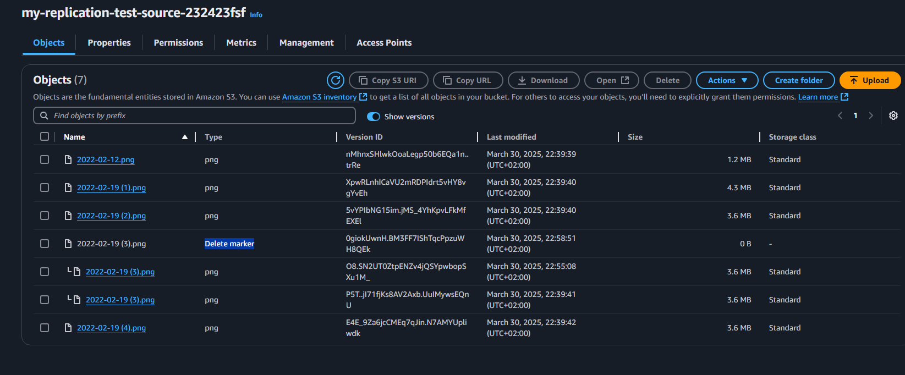

# 📦 S3 Same-Region Replication (SRR) + Versioning

## 📝 Overview
This hands-on demonstrates **S3 Same-Region Replication (SRR)** with **versioning** enabled on both source and destination buckets.  
It covers replication configuration, object replication verification, and versioning behavior with delete markers.

---

## 🔹 Steps Performed

### 1. **Create Buckets**
- **Source bucket:** `my-replication-test-source-232423fsf`
- **Destination bucket:** `my-replication-test-destination-232423fsf`
- Both in the **Europe (Stockholm) `eu-north-1`** region.
- Enabled **versioning** on both buckets.

### 2. **Set Up Replication**
- Created IAM role `SRR-S3` for replication permissions.
- Configured **replication rule** to:
  - Replicate the **entire bucket**.
  - Use **same storage class** as source.
  - Retain replica ownership.
  - Exclude KMS-encrypted objects.
- Verified replication status shows **Enabled**.

### 3. **Upload & Verify Replication**
- Uploaded 5 PNG files to the **source bucket**.
- Confirmed all files replicated automatically to the **destination bucket**.

### 4. **Test Versioning with Delete Marker**
- Uploaded a new version of an existing object (same name).
- Deleted the object → S3 added a **delete marker** instead of permanently deleting.
- Removed the delete marker → Previous version became the current version again.

---

## 🧠 Key Learnings
- **SRR (Same-Region Replication)** is useful for compliance, low-latency access, and redundancy within the same AWS region.
- **Versioning**:
  - Multiple versions of the same object can exist.
  - A “delete” only hides the object by adding a **delete marker**.
  - Removing the delete marker restores the previous version.
- **Replication**:
  - Both source and destination must have versioning enabled.
  - IAM role must allow replication actions (`s3:ReplicateObject`, `s3:ReplicateDelete`, etc.).
- Lifecycle rules are **not required** for replication, but can be combined for automated archival or deletion.

---

## 📷 Screenshots
1. **Replication rule configuration**  
   
2. **Source bucket objects**  
   
3. **Destination bucket objects**  
   
4. **Versioning & Delete marker behavior**  
   

---

## 📦 Skills Demonstrated
- S3 Same-Region Replication setup.
- IAM role creation for replication.
- S3 Versioning management.
- Understanding delete marker behavior.
- Verifying replication and version history.

#AWS #S3 #SameRegionReplication #Versioning #DeleteMarker #CloudComputing #AWSSolutionsArchitect #AWSSAA #AWSHandsOn #Serverless #CloudStorage #DevOps #CloudEngineer #DataProtection #DisasterRecovery
