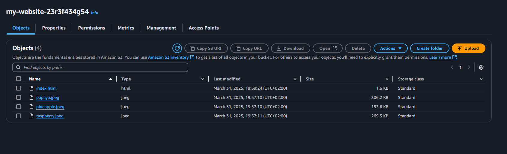
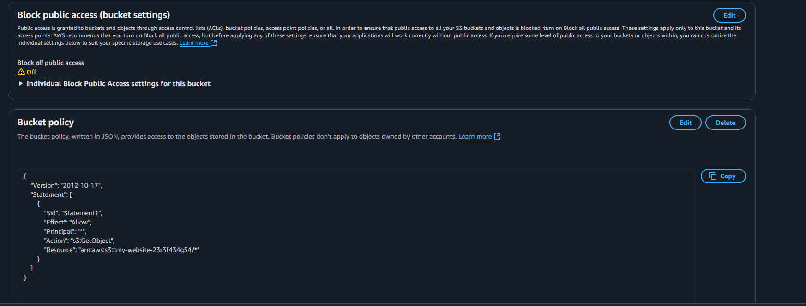

# 🌐 Static Website Hosting on Amazon S3

This project demonstrates how to host a simple static website on **Amazon S3**.  
The site displays a gallery of images (papaya, pineapple, raspberry) served from an S3 bucket configured for static website hosting.

---

## 🚀 Project Steps

### 1. Upload Website Files
- Created an S3 bucket (`my-website-23r3f434g54`).
- Uploaded:
  - `index.html` -> website homepage
  - `papaya.jpeg` 
  - `pineapple.jpeg` 
  - `raspberry.jpeg`

📸 *Screenshot – Objects in S3 bucket:*  

---

### 2. Configure Bucket Policy
- Disabled **Block Public Access**.
- Added a bucket policy to allow public `GetObject` requests for all files.

📸 *Screenshot – Bucket policy:*  

---

### 3. Enable Static Website Hosting
- Enabled **Static Website Hosting** in the bucket properties.
- Chose “Bucket hosting” and used `index.html` as the entry point.

📸 *Screenshot – Static hosting settings:*  

---

📸 *Screenshot – website:*  

---

## 🧠 Key Learnings
- S3 buckets are private by default → you must configure permissions carefully.  
- Static website hosting in S3 works only via the **website endpoint**, not the REST API endpoint.  
- Public access requires:
- Turning off “Block Public Access”
- Adding a bucket policy for `s3:GetObject`  
- Simple static sites (HTML, CSS, JS, images) can be hosted without servers or databases.
